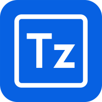

<p align="center">
    <a href="https://www.toolzz.com.br/home" target="_blank"> 
            
    </a>
</p>

## 📝 Introdução

Olá! Este repositório contém a minha solução para o desafio da Edulabzz/Toolzz. Trata-se de um sistema simples de chat em tempo real utilizando Laravel e Next.js.

Se precisar entrar em contato, você pode me encontrar no [LinkedIn](https://www.linkedin.com/in/giovani-appezzato-414a6424b/), pelo e-mail giovani.appezzato@gmail.com ou no número (19) 99494-7867.

Versão em produção: https://giovani-appezzato-challenge-toolzz.vercel.app/sign-in

## 🚀 Começando

Siga as **instruções** abaixo para configurar o ambiente e rodar o front-end do projeto localmente.

### 📋 Pré-requisitos

Antes de começar, verifique se você possui as seguintes dependências instaladas. Caso contrário, faça o download e instale-as para prosseguir:

* [Git](https://git-scm.com/downloads) 
* [NPM (8.5.5)](https://www.npmjs.com/)
* [Yarn](https://yarnpkg.com/)
* [Node (20.15.0)](https://nodejs.org/en/)

### 🔧 Instalação

Após ter configurado o ambiente, siga as etapas para instalar o projeto:

1. Clone o repositório::

```
git clone https://github.com/GiovaniAppezzato/corelab-challenge-web-app-php
```

2. Navegue até a pasta do projeto e execute o comando abaixo para instalar todas as dependências necessárias:

```
yarn install
```

3. Após a conclusão da instalação, crie o arquivo de configuração com o comando a seguir na raiz do projeto:

```
cp .env.example .env
```

4. Abra o arquivo `.env` e configure as variáveis de ambiente conforme necessário. Certifique-se de especificar o IP e a porta onde o backend está rodando:

```
# Example
NEXT_PUBLIC_API_PREFIX="/api"
NEXT_PUBLIC_API_URL="http://127.0.0.1:8001"

NEXT_PUBLIC_PUSHER_APP_KEY="your-pusher-app-key"
NEXT_PUBLIC_PUSHER_APP_CLUSTER="your-pusher-app-cluster"
```

5. Pronto! Agora você pode executar o projeto usando os seguinte comando:

```
yarn run dev
```
